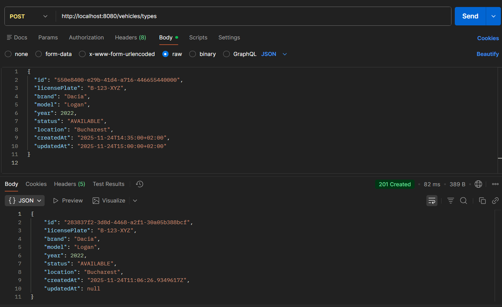

## Build
```bash
mvn install -DskipTests 

```
## API
### POST @ / vehicles/types

#### Description
This endpoint allows the creation of a new vehicle type in the memory for now.
#### Validations
No validations
#### Request examples
```
{
  "id": "550e8400-e29b-41d4-a716-446655440000",
  "licensePlate": "B-123-XYZ",
  "brand": "Dacia",
  "model": "Logan",
  "year": 2022,
  "status": "AVAILABLE",
  "location": "Bucharest",
  "createdAt": "2025-11-24T14:35:00+02:00",
  "updatedAt": "2025-11-24T15:00:00+02:00"
}

```

#### Response examples
```
{
    "id": "283837f2-3d8d-4468-a2f1-30a05b388bcf",
    "licensePlate": "B-123-XYZ",
    "brand": "Dacia",
    "model": "Logan",
    "year": 2022,
    "status": "AVAILABLE",
    "location": "Bucharest",
    "createdAt": "2025-11-24T11:06:26.9349617Z",
    "updatedAt": null
}
```