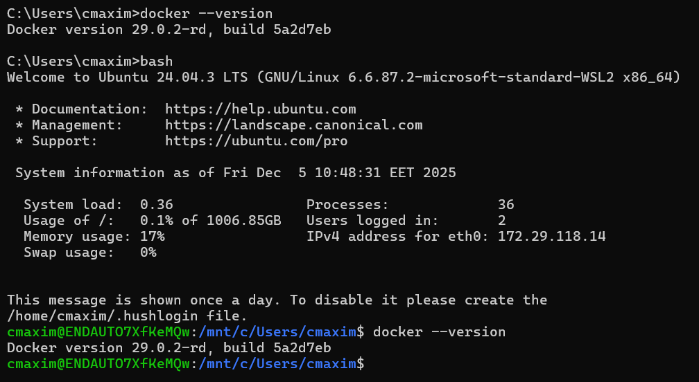

# Local Deployment via Rancher Desktop and Docker

## Overview
- This module provides scripts and Maven profiles to deploy all microservices locally using Docker Compose.
- The setup allows developers to build Docker images for the entire system and run all services simultaneously for local testing and validation.

## Prerequisites
- Install Rancher Desktop with Docker support enabled.
  - Ensure the Docker CLI is accessible from the terminal by running:
    ```bash
    docker --version
    ```
  -Ensure that a bash-compatible shell is available.
  On Windows, this requires using WSL, and WSL integration must be enabled for your Linux distribution in Rancher Desktop settings.
  
  

## Build Services
- Navigate to the root directory of the project.
- Run the following Maven commands to deploy locally through Docker:
  1. Build Docker images for all services:
  ```bash
  mvn clean install -Pdocker
  ```
  2. Deploy all services locally using Docker Compose:
    ```bash 
    mvn install -Pdeploy-local -pl deploy/local
    ```

## Deployment Workflow
   1. Activate the docker profile → Maven builds all microservice images using Jib and publishes them to the local Docker environment.
   2. Activate the deploy-local profile → Maven uses Docker Compose to start all services defined in the `docker-compose.yml` file located in the `deploy/local` directory.
   3. The deployment starts:
      - All microservices
      - PostgreSQL database
      - pgAdmin
   4. All services will be accessible at their respective endpoints as defined in the Docker Compose configuration.

### Database & pgAdmin
**_`Database`_** 
  - Database name: `car_app_db`
  - Username: `car_app_user`
  - Password: `jvngrs`
  - PostgreSQL container name: `database`

The database container includes a healthcheck and all application services depend on it being healthy before startup.

### pgAdmin Access

**Option A** — *pgAdmin Web (Docker container)*

> URL: *http://localhost:5050*

Login credentials:
- Email: `admin@example.com`
- Password: `admin`

***Servers > Register > Server***

- Name: `JVNGRS-DB`
- Host: `database`
- Port: `5432`
- Database:` car_app_db`
- Username: `car_app_user`
- Password: `jvngrs`

**Option B** — *pgAdmin Desktop (installed locally)*

> Use this option if pgAdmin is installed directly on the host machine.

***Servers > Register > Server***

- Name: `JVNGRS-DB`
- Host: `localhost`
- Port:` 5433`
- Database: `car_app_db`
- Username:` car_app_user`
- Password:` jvngrs`


## Status healthy Check
- After deployment, you can check the health status of each service by accessing their healthcheck endpoints:
  - Gateway: `http://localhost:9090/actuator/healthcheckendpoint`
  - Analytics Service: `http://localhost:9091/actuator/healthcheckendpoint`
  - Auth Service: `http://localhost:9092/actuator/healthcheckendpoint`
  - Billing Service: `http://localhost:9093/actuator/healthcheckendpoint`
  - Customer Service: `http://localhost:9094/actuator/healthcheckendpoint`
  - Notification Service: `http://localhost:9095/actuator/healthcheckendpoint`
  - Reservation Service: `http://localhost:9096/actuator/healthcheckendpoint`
  - Vehicle Service: `http://localhost:9097/actuator/healthcheckendpoint`
- A successful response will return:
  ```json
  { "status": "UP" }
  ```