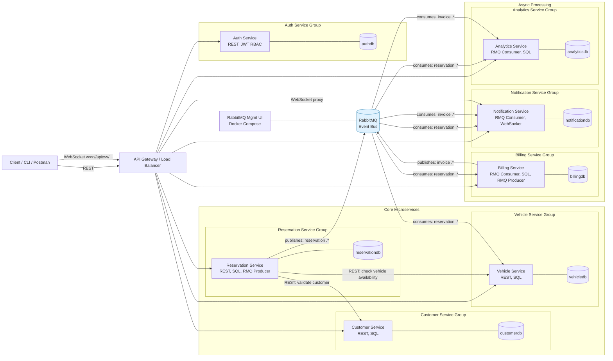
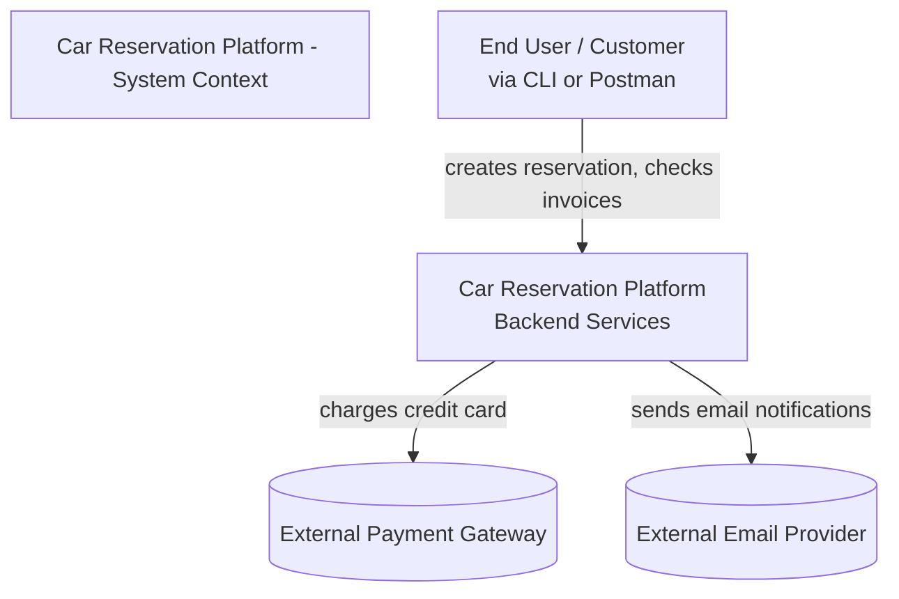
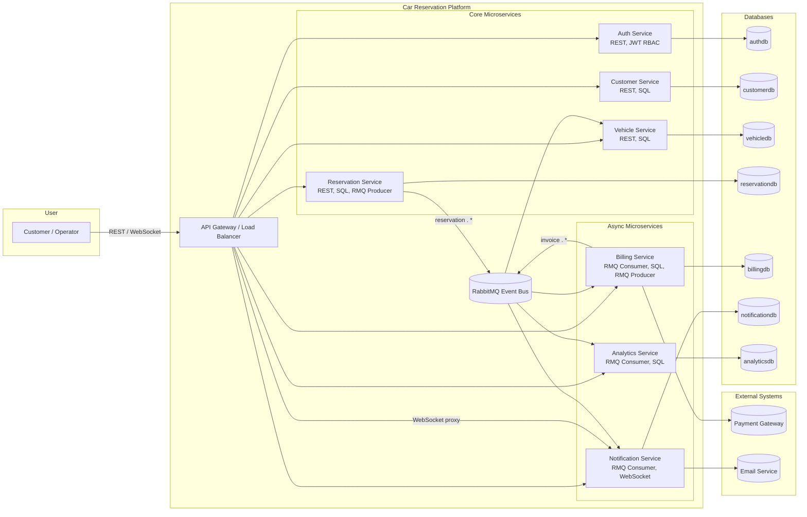
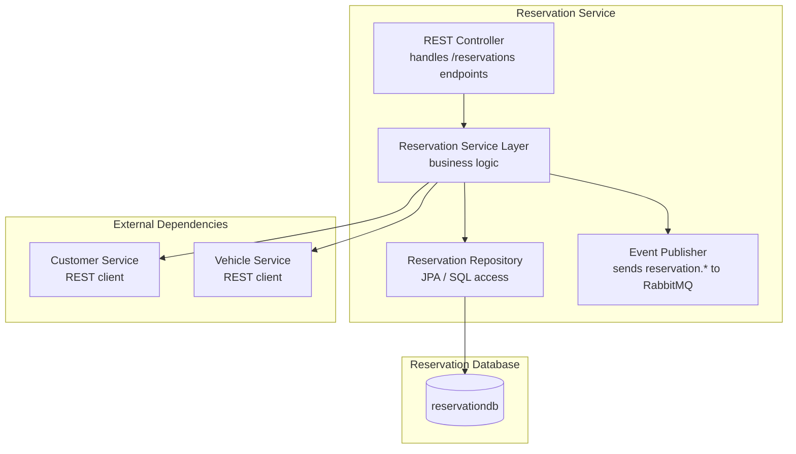
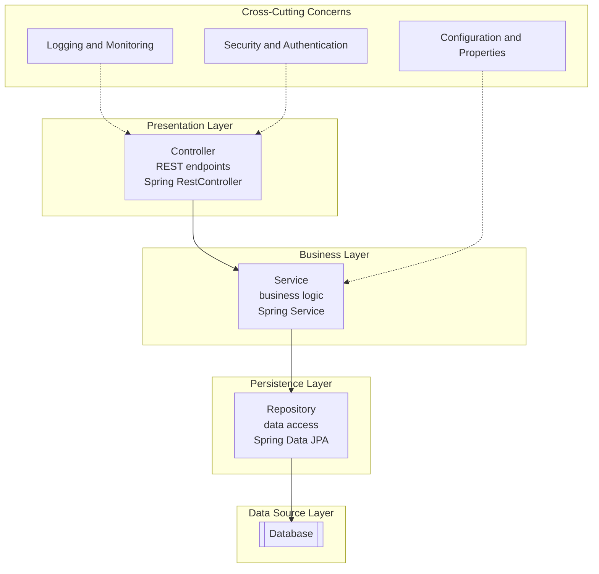
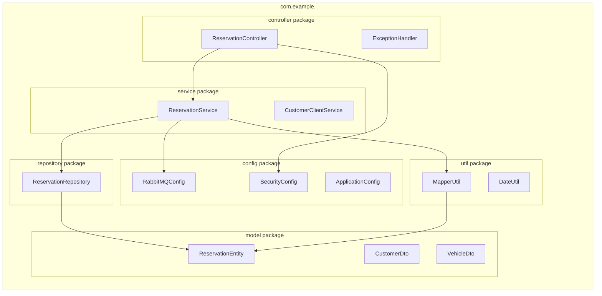
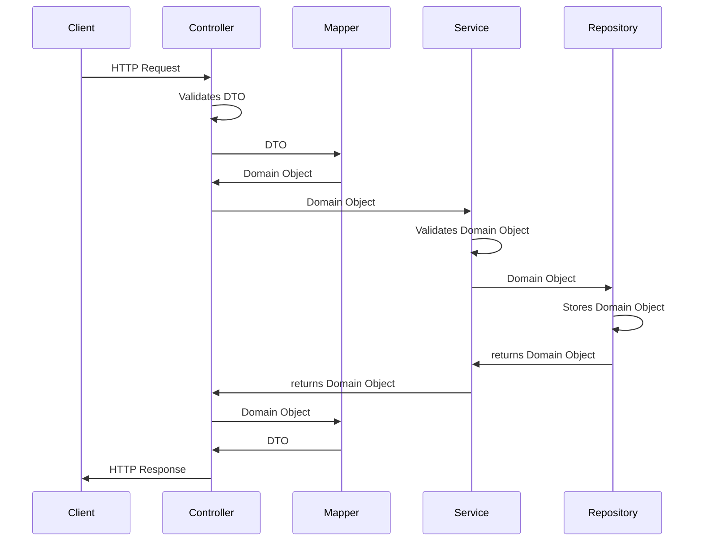

# 🏗️ Architecture

# System Diagrams

## Flowchart

## C4 Model Overview

### C1 — System Context Diagram

### C2 - Container Diagram

### C3 — Component Diagram (Reservation Service)

---

# 🧩 N-Layer Architecture (inside each microservice)

### Entity Creation Sequence Diagram

## ✅ Layer Responsibilities

| Layer                      | Package          | Purpose                                              | Example classes                               |
|----------------------------|------------------|------------------------------------------------------|-----------------------------------------------|
| **Presentation Layer**     | `controller`     | Exposes REST endpoints, handles input/output mapping | `ReservationController`, `ExceptionHandler`   |
| **Business Layer**         | `service`        | Implements business logic and integration            | `ReservationService`, `CustomerClientService` |
| **Persistence Layer**      | `repository`     | Handles database access using JPA                    | `ReservationRepository`                       |
| **Domain / Data Models**   | `model`          | Contains JPA entities and DTOs                       | `ReservationEntity`, `CustomerDto`            |
| **Cross-Cutting Concerns** | `config`, `util` | Shared configuration, utilities, mapping helpers     | `RabbitMQConfig`, `MapperUtil`                |

# Key notes:

- API Gateway receives client REST calls and routes to the appropriate service.
- Reservation Service is the orchestrator: it performs synchronous REST checks against Customer and Vehicle, persists
  the reservation, then publishes reservation.* events to RabbitMQ.
- Billing, Notification, Analytics, and Vehicle services consume RabbitMQ events and act asynchronously. Billing may
  publish invoice.* back to RabbitMQ.
- Notification Service pushes real-time updates to clients via WebSocket channels (no UI required — students can use
  Postman / wscat / browser devtools).
- Each service owns its own database (database-per-service pattern) to practice bounded contexts and avoid shared-schema
  coupling.
