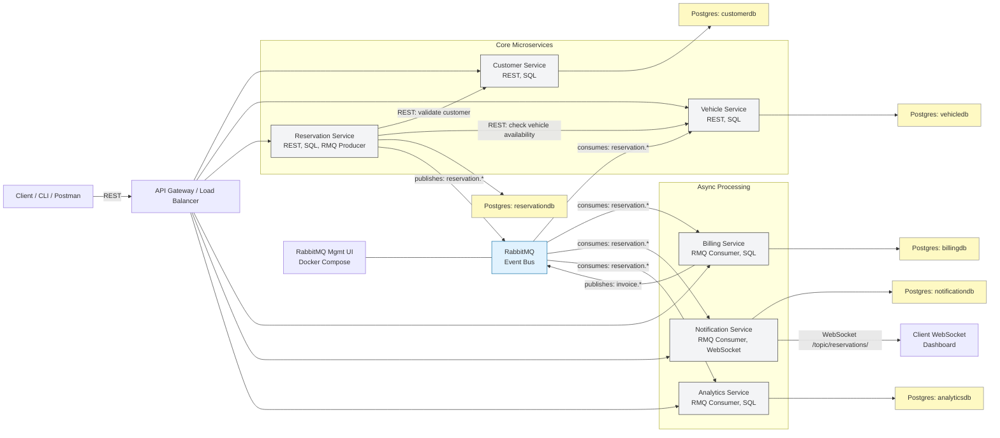

# 🏗️ Architecture

## Key notes:
- API Gateway receives client REST calls and routes to the appropriate service.
- Reservation Service is the orchestrator: it performs synchronous REST checks against Customer and Vehicle, persists the reservation, then publishes reservation.* events to RabbitMQ.
- Billing, Notification, Analytics, and Vehicle services consume RabbitMQ events and act asynchronously. Billing may publish invoice.* back to RabbitMQ.
- Notification Service pushes real-time updates to clients via WebSocket channels (no UI required — students can use Postman / wscat / browser devtools).
- Each service owns its own database (database-per-service pattern) to practice bounded contexts and avoid shared-schema coupling.
