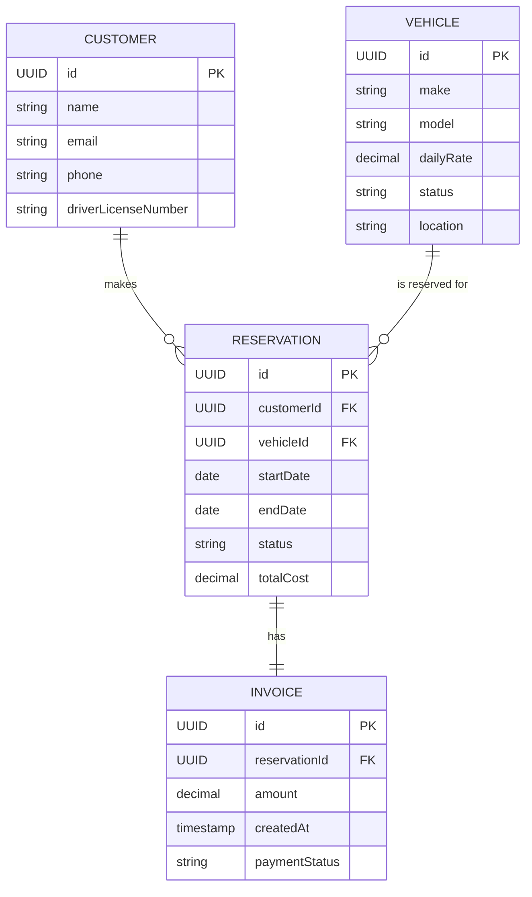

# 🗃️ Data Model (Simplified)

```mermaid
erDiagram
    CUSTOMER {
        UUID id PK
        string name
        string email
        string phone
        string driverLicenseNumber
    }

    VEHICLE {
        UUID id PK
        string make
        string model
        decimal dailyRate
        string status
        string location
    }

    RESERVATION {
        UUID id PK
        UUID customerId FK
        UUID vehicleId FK
        date startDate
        date endDate
        string status
        decimal totalCost
    }

    INVOICE {
        UUID id PK
        UUID reservationId FK
        decimal amount
        timestamp createdAt
        string paymentStatus
    }

    CUSTOMER ||--o{ RESERVATION: "makes"
    VEHICLE ||--o{ RESERVATION: "is reserved for"
    RESERVATION ||--|| INVOICE: "has"
```