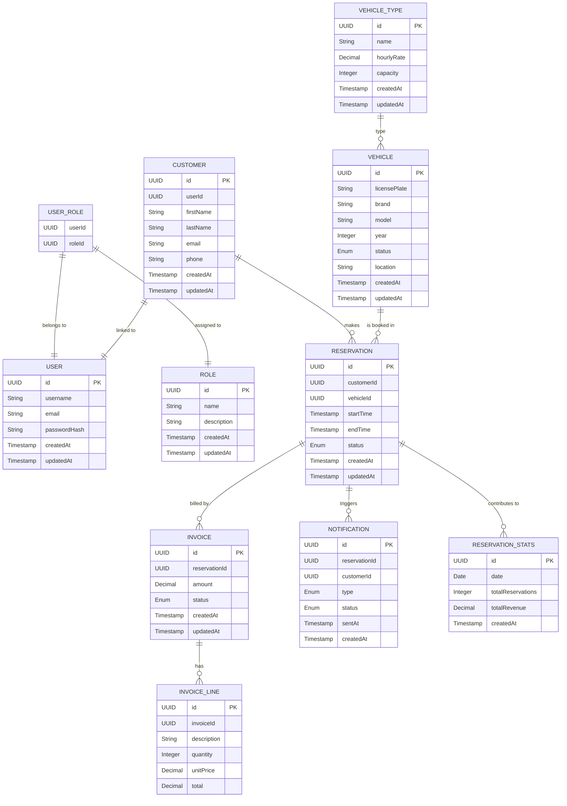
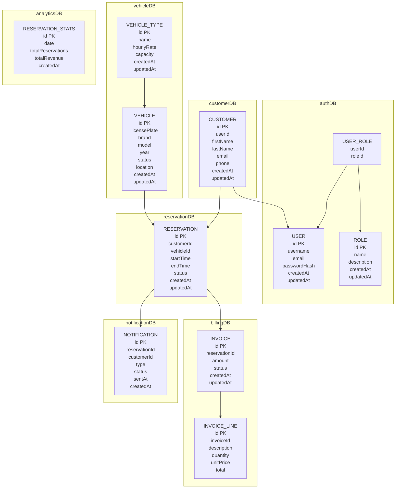

# 🗃️ Data Model

```mermaid
erDiagram

%% ====================
%% Auth Service DB
%% ====================
    USER {
        UUID id PK
        String username
        String email
        String passwordHash
        Timestamp createdAt
        Timestamp updatedAt
    }

    ROLE {
        UUID id PK
        String name
        String description
        Timestamp createdAt
        Timestamp updatedAt
    }

    USER_ROLE {
        UUID userId
        UUID roleId
    }

    USER_ROLE ||--|| USER: "belongs to"
    USER_ROLE ||--|| ROLE: "assigned to"
%% ====================
%% Customer Service DB
%% ====================
    CUSTOMER {
        UUID id PK
        UUID userId
        String firstName
        String lastName
        String email
        String phone
        Timestamp createdAt
        Timestamp updatedAt
    }

    CUSTOMER ||--|| USER: "linked to"
%% ====================
%% Vehicle Service DB
%% ====================
    VEHICLE_TYPE {
        UUID id PK
        String name
        Decimal hourlyRate
        Integer capacity
        Timestamp createdAt
        Timestamp updatedAt
    }

    VEHICLE {
        UUID id PK
        String licensePlate
        String brand
        String model
        Integer year
        Enum status
        String location
        Timestamp createdAt
        Timestamp updatedAt
    }

    VEHICLE_TYPE ||--o{ VEHICLE: "type"
%% ====================
%% Reservation Service DB
%% ====================
    RESERVATION {
        UUID id PK
        UUID customerId
        UUID vehicleId
        Timestamp startTime
        Timestamp endTime
        Enum status
        Timestamp createdAt
        Timestamp updatedAt
    }

    CUSTOMER ||--o{ RESERVATION: "makes"
    VEHICLE ||--o{ RESERVATION: "is booked in"
%% ====================
%% Billing Service DB
%% ====================
    INVOICE {
        UUID id PK
        UUID reservationId
        Decimal amount
        Enum status
        Timestamp createdAt
        Timestamp updatedAt
    }

    INVOICE_LINE {
        UUID id PK
        UUID invoiceId
        String description
        Integer quantity
        Decimal unitPrice
        Decimal total
    }

    INVOICE ||--o{ INVOICE_LINE: "has"
    RESERVATION ||--o{ INVOICE: "billed by"
%% ====================
%% Notification Service DB
%% ====================
    NOTIFICATION {
        UUID id PK
        UUID reservationId
        UUID customerId
        Enum type
        Enum status
        Timestamp sentAt
        Timestamp createdAt
    }

    RESERVATION ||--o{ NOTIFICATION: "triggers"
%% ====================
%% Analytics Service DB
%% ====================
    RESERVATION_STATS {
        UUID id PK
        Date date
        Integer totalReservations
        Decimal totalRevenue
        Timestamp createdAt
    }

    RESERVATION ||--o{ RESERVATION_STATS: "contributes to"

```

```mermaid
flowchart TB
%% Auth DB
    subgraph authDB["authDB"]
        USER[USER<br/>id PK<br/>username<br/>email<br/>passwordHash<br/>createdAt<br/>updatedAt]
        ROLE[ROLE<br/>id PK<br/>name<br/>description<br/>createdAt<br/>updatedAt]
        USER_ROLE[USER_ROLE<br/>userId<br/>roleId]
        USER_ROLE --> USER
        USER_ROLE --> ROLE
    end

%% Customer DB
    subgraph customerDB["customerDB"]
        CUSTOMER[CUSTOMER<br/>id PK<br/>userId<br/>firstName<br/>lastName<br/>email<br/>phone<br/>createdAt<br/>updatedAt]
    end

%% Vehicle DB
    subgraph vehicleDB["vehicleDB"]
        VEHICLE_TYPE[VEHICLE_TYPE<br/>id PK<br/>name<br/>hourlyRate<br/>capacity<br/>createdAt<br/>updatedAt]
        VEHICLE[VEHICLE<br/>id PK<br/>licensePlate<br/>brand<br/>model<br/>year<br/>status<br/>location<br/>createdAt<br/>updatedAt]
        VEHICLE_TYPE --> VEHICLE
    end

%% Reservation DB
    subgraph reservationDB["reservationDB"]
        RESERVATION[RESERVATION<br/>id PK<br/>customerId<br/>vehicleId<br/>startTime<br/>endTime<br/>status<br/>createdAt<br/>updatedAt]
    end

%% Billing DB
    subgraph billingDB["billingDB"]
        INVOICE[INVOICE<br/>id PK<br/>reservationId<br/>amount<br/>status<br/>createdAt<br/>updatedAt]
        INVOICE_LINE[INVOICE_LINE<br/>id PK<br/>invoiceId<br/>description<br/>quantity<br/>unitPrice<br/>total]
        INVOICE --> INVOICE_LINE
    end

%% Notification DB
    subgraph notificationDB["notificationDB"]
        NOTIFICATION[NOTIFICATION<br/>id PK<br/>reservationId<br/>customerId<br/>type<br/>status<br/>sentAt<br/>createdAt]
    end

%% Analytics DB
    subgraph analyticsDB["analyticsDB"]
        RESERVATION_STATS[RESERVATION_STATS<br/>id PK<br/>date<br/>totalReservations<br/>totalRevenue<br/>createdAt]
    end

%% Relationships (logical)
    CUSTOMER --> USER
    CUSTOMER --> RESERVATION
    VEHICLE --> RESERVATION
    RESERVATION --> INVOICE
    RESERVATION --> NOTIFICATION

```