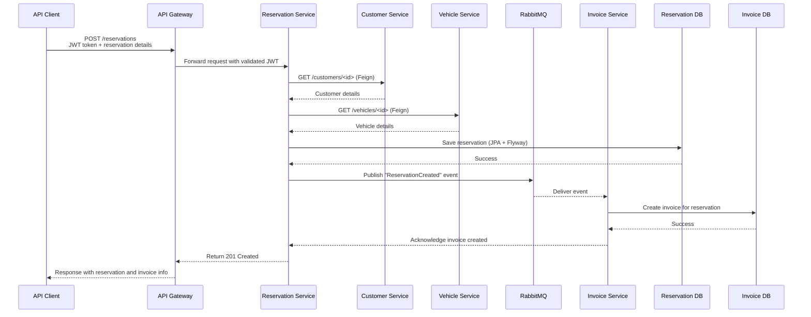
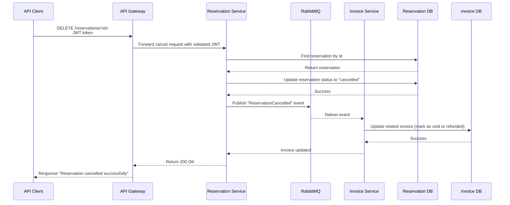
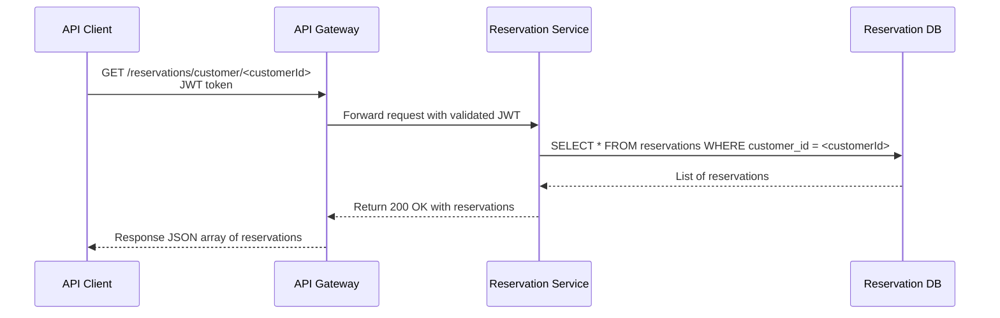
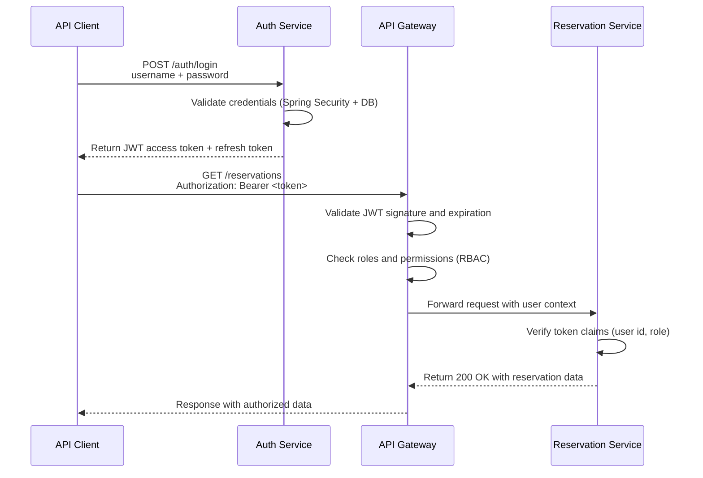
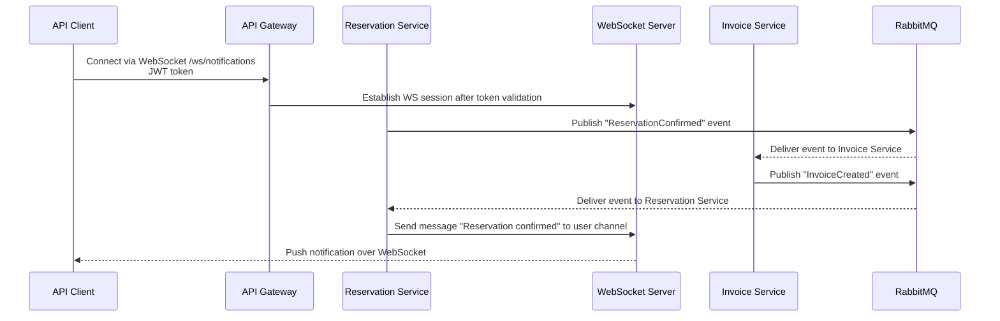
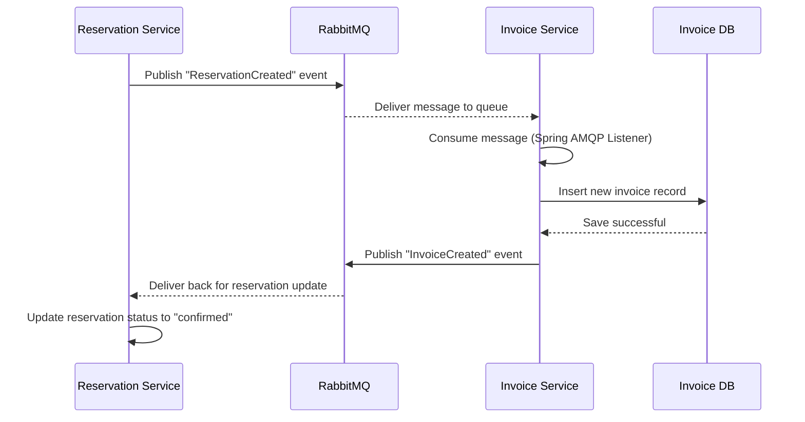
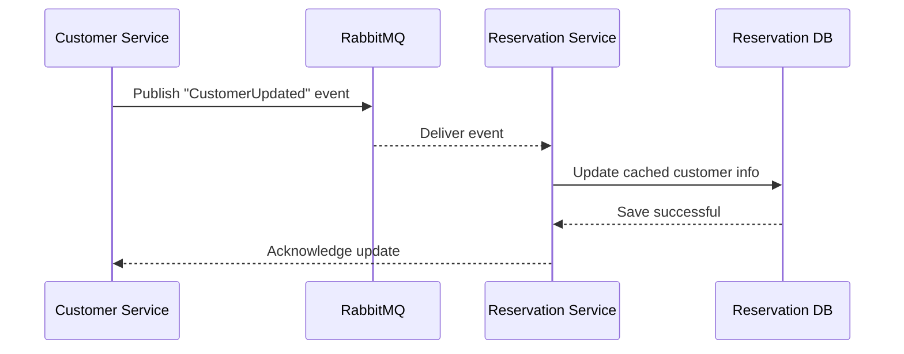
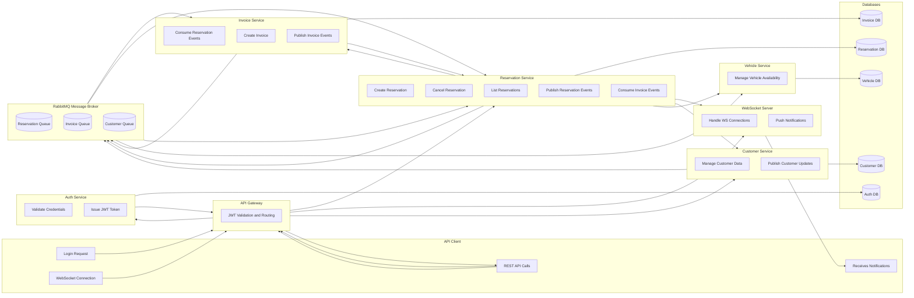

# 🔁 Typical Flows

## 🧩 Flow 1 — Create Reservation

### 🧠 Flow Description

| Step | Action                                             | Notes                             |
|------|----------------------------------------------------|-----------------------------------|
| 1    | Client sends reservation request with JWT          | Gateway authenticates token       |
| 2    | Reservation Service validates customer and vehicle | Uses Feign Clients                |
| 3    | Reservation saved via JPA                          | Flyway ensures schema consistency |
| 4    | Event published via RabbitMQ                       | Asynchronous message              |
| 5    | Invoice Service consumes event                     | Generates and stores invoice      |
| 6    | Final response returned to client                  | Includes confirmation data        |

## 🧩 Flow 2 — Cancel Reservation

### 🧠 Flow Description

| Step | Action                                           | Notes                       |
|------|--------------------------------------------------|-----------------------------|
| 1    | Client requests cancellation via DELETE endpoint | JWT validated by Gateway    |
| 2    | Reservation Service updates DB                   | Marks record as *cancelled* |
| 3    | Event published via RabbitMQ                     | Asynchronous propagation    |
| 4    | Invoice Service consumes event                   | Adjusts invoice accordingly |
| 5    | Response returned to client                      | Indicates success           |

## 🧩 Flow 3 — List Reservations for Customer

### 🧠 Flow Description

| Step | Action                             | Notes                            |
|------|------------------------------------|----------------------------------|
| 1    | Client requests their reservations | JWT validated by Gateway         |
| 2    | Reservation Service queries DB     | Uses JPA repository or @Query    |
| 3    | Data returned as DTOs              | Avoids exposing entity internals |
| 4    | Client receives result             | Sorted and filtered list         |

## 🧩 Flow 4 — Authentication and Authorization (JWT RBAC)

### 🧠 Flow Description

| Step | Action                                                  | Notes                                           |
|------|---------------------------------------------------------|-------------------------------------------------|
| 1    | Client sends login credentials to Auth Service          | Typically username and password                 |
| 2    | Auth Service validates and issues JWT                   | Signed with private key, includes role claims   |
| 3    | Client stores and attaches token to requests            | `Authorization: Bearer <token>`                 |
| 4    | API Gateway validates token                             | Signature, expiry, and roles (RBAC enforcement) |
| 5    | Request forwarded with user context                     | Gateway may add headers like `X-User-Id`        |
| 6    | Reservation Service performs fine-grained authorization | Checks user ownership or roles                  |
| 7    | Authorized data returned                                | Client receives only allowed information        |

### ✅ Security Design Summary

| Component               | Responsibility                                |
|-------------------------|-----------------------------------------------|
| **Auth Service**        | Issues and refreshes JWT tokens               |
| **API Gateway**         | Validates tokens and enforces RBAC policies   |
| **Downstream Services** | Perform domain-specific authorization checks  |
| **JWT Tokens**          | Contain user ID, roles, expiry, and signature |

## 🧩 Flow 5 — Real-Time Reservation Notification (WebSocket)

### 🧠 Flow Description

| Step | Action                                     | Notes                            |
|------|--------------------------------------------|----------------------------------|
| 1    | Client connects to WebSocket endpoint      | JWT validated at connection      |
| 2    | Reservation confirmed triggers event       | Sent asynchronously via RabbitMQ |
| 3    | Invoice Service processes event            | Creates invoice and emits update |
| 4    | Reservation Service receives invoice event | Updates reservation status       |
| 5    | WebSocket notification sent to client      | Real-time confirmation           |

## 🧩 Flow 6 — Invoice Event Handling (Asynchronous via RabbitMQ)

### 🧠 Flow Description

| Step | Action                                | Notes                                  |
|------|---------------------------------------|----------------------------------------|
| 1    | Reservation Service emits event       | Asynchronous communication             |
| 2    | RabbitMQ routes event                 | Queue-based delivery                   |
| 3    | Invoice Service consumes it           | Generates and stores invoice           |
| 4    | Invoice Service emits follow-up event | Enables reactive update on Reservation |
| 5    | Reservation Service updates DB        | Marks reservation as confirmed         |

## 🧩 Flow 7 — Customer Synchronization Across Services (Optional)

### 🧠 Flow Description

| Step | Action                                  | Notes                              |
|------|-----------------------------------------|------------------------------------|
| 1    | Customer data changes                   | e.g., phone number or email        |
| 2    | Event published via RabbitMQ            | Keeps microservices in sync        |
| 3    | Reservation Service updates local cache | Ensures consistency for reporting  |
| 4    | Update acknowledged                     | Optional confirmation or log entry |

## ✅ Summary of All Flows

| Flow                      | Type     | Key Components                          | Communication        |
|---------------------------|----------|-----------------------------------------|----------------------|
| 1. Create Reservation     | Core     | Reservation, Customer, Vehicle, Invoice | REST + RabbitMQ      |
| 2. Cancel Reservation     | Core     | Reservation, Invoice                    | REST + RabbitMQ      |
| 3. List Reservations      | Core     | Reservation                             | REST                 |
| 4. Authentication         | Security | Auth, Gateway                           | REST + JWT           |
| 5. Real-Time Notification | UX       | Reservation, WebSocket                  | WebSocket + RabbitMQ |
| 6. Invoice Event Handling | Async    | Reservation, Invoice                    | RabbitMQ             |
| 7. Customer Sync          | Optional | Customer, Reservation                   | RabbitMQ             |

## 🌐 Global Interaction Overview — IntelliJ-Compatible

### 🧠 Diagram Explanation

| Area            | Description                                                                  |
|-----------------|------------------------------------------------------------------------------|
| **CLIENT**      | Acts as the entry point. All traffic (REST and WS) goes through the Gateway. |
| **GATEWAY**     | Central access point. Validates JWT, routes to internal services.            |
| **AUTH**        | Issues and refreshes tokens. Uses `Auth DB`.                                 |
| **RESERVATION** | Core domain logic for reservations, publishes and consumes events.           |
| **INVOICE**     | Generates invoices from Reservation events and emits status updates.         |
| **CUSTOMER**    | Manages user data and synchronizes updates across services.                  |
| **VEHICLE**     | Maintains vehicle data and availability.                                     |
| **RMQ**         | Event bus for async communication. Routes messages between services.         |
| **WS SERVER**   | Sends real-time notifications to clients (e.g., reservation status).         |
| **DATABASES**   | Each service owns its schema for true microservice autonomy.                 |

### 🚦 Key Communication Types

| Communication Type       | Examples                                    | Technologies               |
|--------------------------|---------------------------------------------|----------------------------|
| **REST (Sync)**          | `/auth/login`, `/reservations`, `/vehicles` | Spring Web + Feign Clients |
| **Async Messaging**      | Reservation and Invoice events              | RabbitMQ + Spring AMQP     |
| **Real-Time Updates**    | Reservation status notifications            | WebSocket over Gateway     |
| **Schema & Persistence** | Separate schema per service                 | PostgreSQL + Flyway        |
| **Security**             | Authentication, RBAC enforcement            | JWT + API Gateway          |

