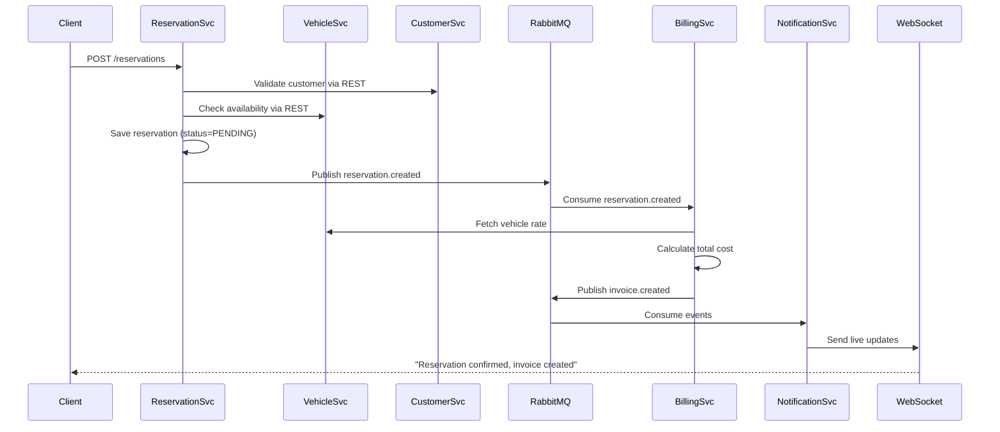

# 🔁 Typical Flows

## Creating a Reservation

```mermaid
sequenceDiagram
    participant Client
    participant ReservationSvc
    participant VehicleSvc
    participant CustomerSvc
    participant RabbitMQ
    participant BillingSvc
    participant NotificationSvc
    participant WebSocket
    Client ->> ReservationSvc: POST /reservations
    ReservationSvc ->> CustomerSvc: Validate customer via REST
    ReservationSvc ->> VehicleSvc: Check availability via REST
    ReservationSvc ->> ReservationSvc: Save reservation (status=PENDING)
    ReservationSvc ->> RabbitMQ: Publish reservation.created
    RabbitMQ ->> BillingSvc: Consume reservation.created
    BillingSvc ->> VehicleSvc: Fetch vehicle rate
    BillingSvc ->> BillingSvc: Calculate total cost
    BillingSvc ->> RabbitMQ: Publish invoice.created
    RabbitMQ ->> NotificationSvc: Consume events
    NotificationSvc ->> WebSocket: Send live updates
    WebSocket -->> Client: "Reservation confirmed, invoice created"
```
